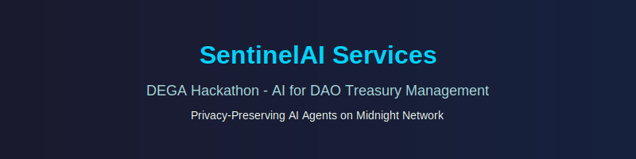

# SentinelAI Services Hackathon Project

## Resources

- **ElizaOS Fork**: https://github.com/bytewizard42i/Eliza-Base-Agent-johns_copy
- **Midnight MCP Fork**: https://github.com/bytewizard42i/midnight-mcp-johns_copy
- **Workshop Document**: https://docs.google.com/document/d/1ld_vhP-pPez-ref21W1m4PUIVJRkuWSEog3N1pAJvis/edit?tab=t.0
- **myAlice Contextual Memory**: https://github.com/bytewizard42i/myAlice

## Project Overview

SentinelAI Services is our submission for the DEGA Hackathon – AI for DAO Treasury Management on Midnight. This project builds privacy-preserving AI agents for DAO treasury management, enabling natural language interactions for wallet management, token transfers, and governance (proposals/voting/withdrawals) using Midnight's zero-knowledge privacy features.

### Key Components
- **Midnight MCP**: Blockchain integration for shielded tokens and DAO tools.
- **ElizaOS**: AI agent framework for natural language processing and Discord integration.
- **myAlice**: Contextual memory for continuity and troubleshooting.
- **SentinelAI Services**: Main repo for hackathon submission and AI functionality.

### Goals
- Automate DAO treasury tasks with AI (e.g., asset allocation, secure workflows).
- Ensure privacy: Untraceable transactions and unlinkable votes.
- Win the hackathon and advance AI-privacy integration.

### Setup Instructions
Refer to the parsed workshop instructions in `Hackathon_Workshop_Instructions.md` for detailed setup.

### Team
- John Santi (Lead)
- Cassie (AI Assistant, via Cascade)

---

*Maintained collaboratively for the hackathon.*
